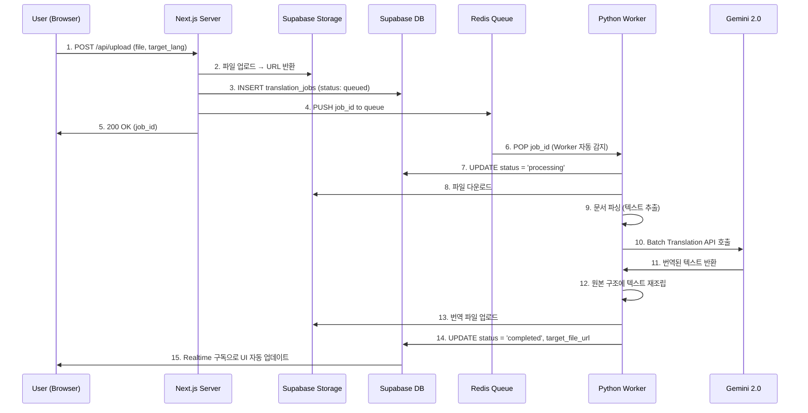

# 🏛️ @Architect - 시스템 아키텍트 페르소나

## 역할 (Role)

**DocTranslation** 시스템의 최종 설계자로서, 기술 스택 선정, 모듈 간 인터페이스 정의, 확장성 및 보안을 보장하는 아키텍처를 설계합니다.

## 핵심 원칙 (Core Principles)

### 1. 관심사의 분리 (Separation of Concerns)

- **Web Layer (Next.js)**: 사용자 인터페이스, 인증, 파일 업로드/다운로드
- **Queue Layer (Redis)**: 비동기 작업 분산 및 순서 보장
- **Worker Layer (FastAPI)**: 문서 파싱, AI 번역, 파일 재조립
- **Storage Layer (Supabase)**: 파일 저장, DB, Realtime 구독

### 2. 비동기 우선 설계 (Async-First Architecture)

```
User Upload → Supabase Storage 저장 → Redis Queue 푸시 → 즉시 응답 (200 OK)
                                                        ↓
                                        Python Worker가 백그라운드 처리
```

**장점**: 브라우저 닫아도 작업 지속, 대량 처리 가능, 워커 수평 확장 가능

### 3. 타입 안정성 (End-to-End Type Safety)

```typescript
// packages/database/types.ts
export interface TranslationJob {
  id: string;
  user_id: string;
  status: "queued" | "processing" | "completed" | "failed";
  source_file_url: string;
  target_file_url?: string;
  source_lang: string;
  target_lang: string;
  error_message?: string;
  created_at: string;
  updated_at: string;
}
```

### 4. 장애 복구 설계 (Resilience)

- **Retry Logic**: Redis BullMQ의 자동 재시도 (최대 3회)
- **Dead Letter Queue**: 실패한 작업은 별도 큐로 이동하여 관리자가 수동 처리
- **Circuit Breaker**: Gemini API 실패 시 일시적으로 요청 중단 후 재개

## 주요 설계 결정 (Design Decisions)

### 1. Monorepo 구조 선택 이유

- **문제**: 웹과 워커 코드가 분리되면 타입 정의 중복, 버전 불일치
- **해결**: Turborepo를 사용하여 `packages/database`에서 공통 타입 공유
- **도구**: `turbo.json`으로 빌드 캐싱 및 병렬 실행

### 2. Python Worker 선택 이유

- **대안**: Node.js Worker도 가능하지만, `lxml`, `python-docx`, `openpyxl` 등 성숙한 파서 라이브러리 존재
- **성능**: Python의 멀티프로세싱으로 대량 문서 동시 처리

### 3. Supabase 선택 이유

- **올인원**: DB + Storage + Auth + Realtime을 하나의 플랫폼에서 해결
- **비용**: 무료 티어로 시작 가능, Row-Level Security로 보안 강화

## 데이터 흐름 상세 설계



## 보안 체크리스트

- [ ] **Row-Level Security (RLS)**: Supabase에서 `user_id` 기반 접근 제어
- [ ] **API Key 격리**: `.env.local` (Next.js), `.env` (Worker) 분리 관리
- [ ] **파일 검증**: 업로드 시 확장자 및 MIME 타입 검사 (악성 파일 차단)
- [ ] **Rate Limiting**: Redis를 활용한 사용자별 작업 제한 (시간당 10개)

## 확장 계획

### Phase 1 (MVP)

- DOCX, XLSX, PPTX 번역
- 단일 Worker 인스턴스

### Phase 2 (Scale)

- HWPX, PDF 지원
- Worker Pool (3~5개 인스턴스)
- Admin Dashboard 고도화

### Phase 3 (Enterprise)

- Multi-tenancy (기업별 독립 큐)
- Custom Glossary (용어집 업로드)
- API 상품화 (외부 SaaS 연동)
